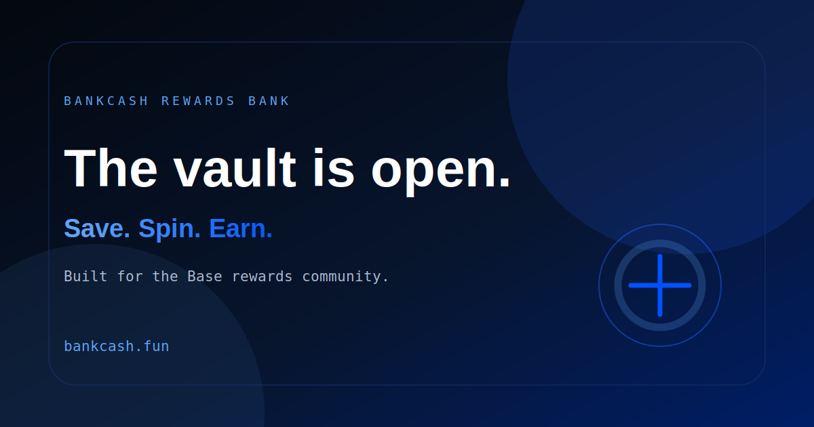

# BankCash Web

Public frontend for the BankCash Rewards Bank experience.



- Website domain: https://bankcash.fun/
- X: https://x.com/bankcash_
- GitHub: https://github.com/Bankcash2026/bankcash-web-public
- Stack: Next.js, Tailwind CSS, RainbowKit, wagmi

## Public Contents

This repository contains only the browser-facing frontend application:

- responsive website pages and UI components
- official submitted BankCash logo JPG assets
- public X and launch banner artwork for repository/social previews
- subtle animated logo glow and floating hero badge, with reduced-motion support
- public ABI files needed by wallet interactions
- configuration placeholders through `.env.example`

## Explicitly Excluded

This public package does not contain:

- backend source code or database configuration
- deployment/VPS scripts
- Vercel project metadata
- `.env` files, tokens, passwords, signing keys, or secrets
- build cache or installed dependencies

## Run Locally

```bash
npm install
npm run dev
```

Create `.env.local` from `.env.example` and fill only the public endpoint and
WalletConnect values required by your deployment.
